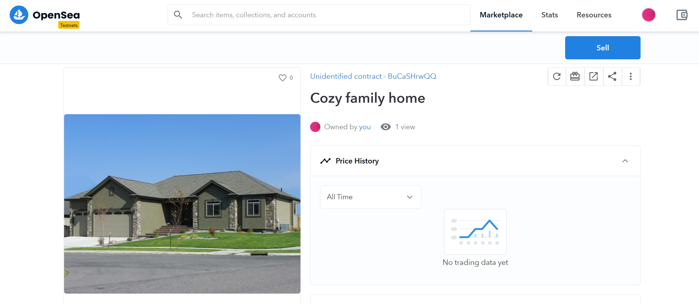

# Decentralized Housing Product

This project creates unique ERC721 Standard tokens for each house that a person owns using the contract which is deployed to the Ethereum Test network called Rinkeby. These tokens can be view using Opensea's testnet

The ownership of the house is verified using a technique called zkSnarks which is implemented on a high level using Zokrates which is developer friendly 

Docker is used to run Zokrates to compile, generate and verify proofs

## CustomERC721Token contract

<a href="https://rinkeby.etherscan.io/address/0x8A8946D188a929a127a04222Dc3B6237659ee42D">Click here</a> to view the CustomERC721Token contract on etherscan

The contract <a href="https://rinkeby.etherscan.io/address/0x8A8946D188a929a127a04222Dc3B6237659ee42D#code">code</a> has been verified and it is visible on `rinkeby.etherscan.io`

## 5 Tokens (NFTs) are minted on Etherscan and viewed on OpenSea




## Links for the OpenSea MarketPlace StoreFront

https://testnets.opensea.io/assets/0x8a8946d188a929a127a04222dc3b6237659ee42d/1

https://testnets.opensea.io/assets/0x8a8946d188a929a127a04222dc3b6237659ee42d/2

https://testnets.opensea.io/assets/0x8a8946d188a929a127a04222dc3b6237659ee42d/3

https://testnets.opensea.io/assets/0x8a8946d188a929a127a04222dc3b6237659ee42d/4

https://testnets.opensea.io/assets/0x8a8946d188a929a127a04222dc3b6237659ee42d/5

## Getting Started

These instructions will get you a copy of the project up and running on your local machine for development and testing purposes. See deployment for notes on how to deploy the project on a live system.

### Prerequisites

Please make sure you've already installed ganache-cli, Truffle and enabled MetaMask extension in your browser.

### Installing

A step by step series of examples that tell you have to get a development environment running

#### Clone this repository:

```
git clone https://github.com/DineshBS44/Blockchain-Capstone
```

Install all requisite npm packages (as listed in `package.json`):

```
npm install
```

#### Launch Ganache:

```
ganache-cli -m "<Seed Phrase>"
```

or

```
truffle develop
```

#### In a separate terminal window, Compile smart contracts:

```
truffle compile
```

This will create the smart contract artifacts in folder `build\contracts`.

Migrate smart contracts to the locally running blockchain, ganache-cli:

```
truffle migrate
```

Or, Migrate smart contracts to the Rinkeby Test Network:

```
truffle migrate --reset --network rinkeby
```

#### Verify the code for the smart contract using Etherscan API through the command

`truffle run verify CustomERC721Token --network rinkeby --license MIT`

#### Test smart contracts:

```
truffle test
```

All 12 tests should pass.

# Project Resources

* [Ethereum](https://www.ethereum.org/) - Ethereum is a decentralized platform that runs smart contracts
* [IPFS](https://ipfs.io/) - IPFS is the Distributed Web | A peer-to-peer hypermedia protocol
  to make the web faster, safer, and more open.
* [Truffle Framework](http://truffleframework.com/) - Truffle is the most popular development framework for Ethereum with a mission to make your life a whole lot easier.
* [Remix - Solidity IDE](https://remix.ethereum.org/) - To compile, test and deploy faster using Javascript VM
* [Visual Studio Code](https://code.visualstudio.com/) - Code Editor
* [Ganache - One Click Blockchain](https://truffleframework.com/ganache) - Local blockchain for testing
* [Open Zeppelin ](https://openzeppelin.org/) - Open source Library of pre-built contracts
* [Interactive zero knowledge 3-colorability demonstration](http://web.mit.edu/~ezyang/Public/graph/svg.html) - To understand zkSnarks better
* [Docker](https://docs.docker.com/install/) - To run Zokrates which implements zkSnarks to generate and verify proofs
* [ZoKrates](https://github.com/Zokrates/ZoKrates) - Higher level language implementation of zkSnarks which is developer friendly

## Libraries/services used

- **ganache-cli** - For running a local blockchain mostly used for testing purposes
- **dotenv** - For managing data in .env files
- **truffle-hdwallet-provider** - Used to create a provider using Seed phrase(Mnemonic) and Infura RPC URL to connect to the Rinkeby Test Network
- **web3** - To interact with the deployed smart contract either on Ganache or Rinkeby test network
- **mocha & chai** - To test the smart contracts written in solidity
- **truffle-plugin-verify** - To verify the smart contract code on Etherscan using its API
- **Etherscan** - View and keep track of transactions happening around a smart contract as well as view its code, read and write stuff to it
- **Remix** - To compile, deploy and test smart contracts on the Javascript VM
- **Metamask** - Ethereum wallet which is connected to the DApp
- **Infura** - For getting the API endpoint to connect to the Etherem network without having to run a full node
- **IPFS** - The image for TokenURI and the JSON file for the tokenURI has been added to IPFS
- **Truffle** - Framework used to write, compile, test and deploy smart contracts with ease

### Additional details

- **Token name** - Greg Housing Token
- **Token symbol** - GGT

The `transaction hash` and `contract address` for the smart contracts deployed to the Rinkeby Test Network are

##### SolnSquareVerifier.sol

- **transaction hash** - 0xfd6b5ce48d72994337d269fc7bf957c1a0751169c6221cb2a683b782118007bc
- **contract address** - 0x7C37024bB62c3db430a8a795d030FfaDBd4094Bb

##### Verifier.sol

- **transaction hash** - 0x3a3ba4a884ec7273893b5fe9375d4ca777fe4c8f9815260fdb0db5f5b159843e
- **contract address** - 0x23000B7b4d9622083DB3faE3ACcD0872F2e7b935

##### CustomERC721Token.sol

- **transaction hash** - 0x970b50f5fde11123877ebb34eafb31a85771a67c31cda221070819664760dff6
- **contract address** - 0x8A8946D188a929a127a04222Dc3B6237659ee42D

### Some versions of Frameworks and Libraries used in this project are

- **Truffle version** - 5.3.14
- **Solidity version** - 0.5.0
- **Node JS version** - 14.16.1
- **truffle-hdwallet-provider version** - 1.0.17

## Contract ABI for SolnSquareVerifier.sol file

- This Contract abi is extracted from `eth-contracts/build/contracts/SolnSquareVerifier.json`

```
[
    {
      "constant": false,
      "inputs": [
        {
          "name": "mode",
          "type": "bool"
        }
      ],
      "name": "setPausedStatus",
      "outputs": [],
      "payable": false,
      "stateMutability": "nonpayable",
      "type": "function"
    },
    {
      "constant": true,
      "inputs": [
        {
          "name": "interfaceId",
          "type": "bytes4"
        }
      ],
      "name": "supportsInterface",
      "outputs": [
        {
          "name": "",
          "type": "bool"
        }
      ],
      "payable": false,
      "stateMutability": "view",
      "type": "function"
    },
    {
      "constant": true,
      "inputs": [
        {
          "name": "tokenId",
          "type": "uint256"
        }
      ],
      "name": "getApproved",
      "outputs": [
        {
          "name": "",
          "type": "address"
        }
      ],
      "payable": false,
      "stateMutability": "view",
      "type": "function"
    },
    {
      "constant": false,
      "inputs": [
        {
          "name": "to",
          "type": "address"
        },
        {
          "name": "tokenId",
          "type": "uint256"
        }
      ],
      "name": "approve",
      "outputs": [],
      "payable": false,
      "stateMutability": "nonpayable",
      "type": "function"
    },
    {
      "constant": false,
      "inputs": [],
      "name": "getSymbol",
      "outputs": [
        {
          "name": "",
          "type": "string"
        }
      ],
      "payable": false,
      "stateMutability": "nonpayable",
      "type": "function"
    },
    {
      "constant": false,
      "inputs": [],
      "name": "getName",
      "outputs": [
        {
          "name": "",
          "type": "string"
        }
      ],
      "payable": false,
      "stateMutability": "nonpayable",
      "type": "function"
    },
    {
      "constant": true,
      "inputs": [],
      "name": "totalSupply",
      "outputs": [
        {
          "name": "",
          "type": "uint256"
        }
      ],
      "payable": false,
      "stateMutability": "view",
      "type": "function"
    },
    {
      "constant": false,
      "inputs": [
        {
          "name": "from",
          "type": "address"
        },
        {
          "name": "to",
          "type": "address"
        },
        {
          "name": "tokenId",
          "type": "uint256"
        }
      ],
      "name": "transferFrom",
      "outputs": [],
      "payable": false,
      "stateMutability": "nonpayable",
      "type": "function"
    },
    {
      "constant": false,
      "inputs": [
        {
          "name": "_myid",
          "type": "bytes32"
        },
        {
          "name": "_result",
          "type": "string"
        }
      ],
      "name": "__callback",
      "outputs": [],
      "payable": false,
      "stateMutability": "nonpayable",
      "type": "function"
    },
    {
      "constant": true,
      "inputs": [
        {
          "name": "owner",
          "type": "address"
        },
        {
          "name": "index",
          "type": "uint256"
        }
      ],
      "name": "tokenOfOwnerByIndex",
      "outputs": [
        {
          "name": "",
          "type": "uint256"
        }
      ],
      "payable": false,
      "stateMutability": "view",
      "type": "function"
    },
    {
      "constant": false,
      "inputs": [
        {
          "name": "_myid",
          "type": "bytes32"
        },
        {
          "name": "_result",
          "type": "string"
        },
        {
          "name": "_proof",
          "type": "bytes"
        }
      ],
      "name": "__callback",
      "outputs": [],
      "payable": false,
      "stateMutability": "nonpayable",
      "type": "function"
    },
    {
      "constant": false,
      "inputs": [
        {
          "name": "from",
          "type": "address"
        },
        {
          "name": "to",
          "type": "address"
        },
        {
          "name": "tokenId",
          "type": "uint256"
        }
      ],
      "name": "safeTransferFrom",
      "outputs": [],
      "payable": false,
      "stateMutability": "nonpayable",
      "type": "function"
    },
    {
      "constant": true,
      "inputs": [
        {
          "name": "index",
          "type": "uint256"
        }
      ],
      "name": "tokenByIndex",
      "outputs": [
        {
          "name": "",
          "type": "uint256"
        }
      ],
      "payable": false,
      "stateMutability": "view",
      "type": "function"
    },
    {
      "constant": true,
      "inputs": [
        {
          "name": "tokenId",
          "type": "uint256"
        }
      ],
      "name": "ownerOf",
      "outputs": [
        {
          "name": "",
          "type": "address"
        }
      ],
      "payable": false,
      "stateMutability": "view",
      "type": "function"
    },
    {
      "constant": true,
      "inputs": [
        {
          "name": "owner",
          "type": "address"
        }
      ],
      "name": "balanceOf",
      "outputs": [
        {
          "name": "",
          "type": "uint256"
        }
      ],
      "payable": false,
      "stateMutability": "view",
      "type": "function"
    },
    {
      "constant": true,
      "inputs": [],
      "name": "getOwner",
      "outputs": [
        {
          "name": "",
          "type": "address"
        }
      ],
      "payable": false,
      "stateMutability": "view",
      "type": "function"
    },
    {
      "constant": false,
      "inputs": [
        {
          "name": "to",
          "type": "address"
        },
        {
          "name": "approved",
          "type": "bool"
        }
      ],
      "name": "setApprovalForAll",
      "outputs": [],
      "payable": false,
      "stateMutability": "nonpayable",
      "type": "function"
    },
    {
      "constant": false,
      "inputs": [
        {
          "name": "from",
          "type": "address"
        },
        {
          "name": "to",
          "type": "address"
        },
        {
          "name": "tokenId",
          "type": "uint256"
        },
        {
          "name": "_data",
          "type": "bytes"
        }
      ],
      "name": "safeTransferFrom",
      "outputs": [],
      "payable": false,
      "stateMutability": "nonpayable",
      "type": "function"
    },
    {
      "constant": false,
      "inputs": [],
      "name": "getBaseTokenURI",
      "outputs": [
        {
          "name": "",
          "type": "string"
        }
      ],
      "payable": false,
      "stateMutability": "nonpayable",
      "type": "function"
    },
    {
      "constant": true,
      "inputs": [
        {
          "name": "tokenId",
          "type": "uint256"
        }
      ],
      "name": "tokenURI",
      "outputs": [
        {
          "name": "",
          "type": "string"
        }
      ],
      "payable": false,
      "stateMutability": "view",
      "type": "function"
    },
    {
      "constant": true,
      "inputs": [
        {
          "name": "owner",
          "type": "address"
        },
        {
          "name": "operator",
          "type": "address"
        }
      ],
      "name": "isApprovedForAll",
      "outputs": [
        {
          "name": "",
          "type": "bool"
        }
      ],
      "payable": false,
      "stateMutability": "view",
      "type": "function"
    },
    {
      "constant": false,
      "inputs": [
        {
          "name": "newOwner",
          "type": "address"
        }
      ],
      "name": "transferOwnership",
      "outputs": [],
      "payable": false,
      "stateMutability": "nonpayable",
      "type": "function"
    },
    {
      "inputs": [
        {
          "name": "_verifierAddress",
          "type": "address"
        }
      ],
      "payable": false,
      "stateMutability": "nonpayable",
      "type": "constructor"
    },
    {
      "anonymous": false,
      "inputs": [
        {
          "indexed": false,
          "name": "tokenId",
          "type": "uint256"
        }
      ],
      "name": "SolutionAccepted",
      "type": "event"
    },
    {
      "anonymous": false,
      "inputs": [
        {
          "indexed": true,
          "name": "from",
          "type": "address"
        },
        {
          "indexed": true,
          "name": "to",
          "type": "address"
        },
        {
          "indexed": true,
          "name": "tokenId",
          "type": "uint256"
        }
      ],
      "name": "Transfer",
      "type": "event"
    },
    {
      "anonymous": false,
      "inputs": [
        {
          "indexed": true,
          "name": "owner",
          "type": "address"
        },
        {
          "indexed": true,
          "name": "approved",
          "type": "address"
        },
        {
          "indexed": true,
          "name": "tokenId",
          "type": "uint256"
        }
      ],
      "name": "Approval",
      "type": "event"
    },
    {
      "anonymous": false,
      "inputs": [
        {
          "indexed": true,
          "name": "owner",
          "type": "address"
        },
        {
          "indexed": true,
          "name": "operator",
          "type": "address"
        },
        {
          "indexed": false,
          "name": "approved",
          "type": "bool"
        }
      ],
      "name": "ApprovalForAll",
      "type": "event"
    },
    {
      "anonymous": false,
      "inputs": [
        {
          "indexed": true,
          "name": "pausedAddress",
          "type": "address"
        }
      ],
      "name": "Paused",
      "type": "event"
    },
    {
      "anonymous": false,
      "inputs": [
        {
          "indexed": true,
          "name": "unpausedAddress",
          "type": "address"
        }
      ],
      "name": "Unpaused",
      "type": "event"
    },
    {
      "anonymous": false,
      "inputs": [
        {
          "indexed": true,
          "name": "newOwner",
          "type": "address"
        }
      ],
      "name": "TransferredOwnership",
      "type": "event"
    },
    {
      "constant": false,
      "inputs": [
        {
          "name": "to",
          "type": "address"
        },
        {
          "name": "tokenId",
          "type": "uint256"
        },
        {
          "name": "tokenURI",
          "type": "string"
        }
      ],
      "name": "mintNoProofRequired",
      "outputs": [
        {
          "name": "",
          "type": "bool"
        }
      ],
      "payable": false,
      "stateMutability": "nonpayable",
      "type": "function"
    },
    {
      "constant": false,
      "inputs": [
        {
          "name": "to",
          "type": "address"
        },
        {
          "name": "tokenId",
          "type": "uint256"
        },
        {
          "name": "tokenURI",
          "type": "string"
        }
      ],
      "name": "mint",
      "outputs": [
        {
          "name": "",
          "type": "bool"
        }
      ],
      "payable": false,
      "stateMutability": "nonpayable",
      "type": "function"
    },
    {
      "constant": false,
      "inputs": [
        {
          "name": "a",
          "type": "uint256[2]"
        },
        {
          "name": "b",
          "type": "uint256[2][2]"
        },
        {
          "name": "c",
          "type": "uint256[2]"
        },
        {
          "name": "input",
          "type": "uint256[2]"
        },
        {
          "name": "tokenId",
          "type": "uint256"
        }
      ],
      "name": "addSolution",
      "outputs": [],
      "payable": false,
      "stateMutability": "nonpayable",
      "type": "function"
    }
]
```

## Developer

<table>
<tr align="center">
<td>
Dinesh B S
<p align="center">

</p>
<p align="center">
<a href = "https://github.com/DineshBS44"></a>
<a href = "https://www.linkedin.com/in/dinesh-b-s-197983192/">

</a>
</p>
</td>
</tr>
  </table>

## License

Licensed under MIT License : https://opensource.org/licenses/MIT

<br>
<br>

